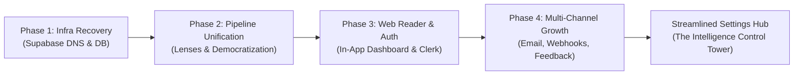

# Senior PM Audit: Settings Scope, Strategic Roadmap Alignment & Streamlining Architecture

## Executive Summary
As AI Digest transitions from an automated Notion-first utility to an autonomous, multi-persona AI research platform with a native in-app Web Reader, the **Settings experience serves as the central control tower** for the user's research intelligence. 

A thorough audit of `web/components/SettingsView.tsx`, `web/app/api/users/config/route.ts`, and database schemas across Supabase reveals that Settings has accumulated significant architectural and UX debt during rapid iterative releases (Phases 1–4). The current interface suffers from:
1. **Fragmented Save Actions:** Four disjointed "Save" buttons causing cognitive friction and silent data loss.
2. **Artificial Channel Bifurcation:** Notion is segregated into an isolated card at the bottom while Email and Slack/Discord are grouped in "Channels & Integrations", obscuring the core product model (In-App Reader as Hub; Notion/Email/Slack as Spokes).
3. **Missing Feedback & AI Transparency:** Users train their recommendation engine via thumbs up/down on papers, but Settings provides zero visibility, curation, or reset capability for their learned topic affinities.
4. **Desktop Layout Anti-Pattern:** A hardcoded `max-w-[480px]` mobile wrapper that wastes 70% of desktop display real estate.
5. **Incomplete Channel Lifecycle:** Missing Notion disconnect action, lack of webhook verification testing, and no "vacation/pause" delivery control.

This document presents a Senior Product Manager audit, correlates current settings against the SPM Unified Roadmap, and outlines a streamlined 4-pillar architecture to modernize the Settings experience.

---

## 1. System Inventory & Audit of Current Settings Scope

### 1.1 Data Model Audit (`user_configs`, `users`, `paper_feedback`)

| Field Name | Type / Constraint | Stored In | API Route Support | UI Exposure in Settings | Status / Gap |
| :--- | :--- | :--- | :--- | :--- | :--- |
| `profile_description` | TEXT (<= 500 chars) | `user_configs` | GET, POST, PATCH | Yes (Textarea) | Working, but lacks character count feedback present in onboarding |
| `digest_lens` | Enum: `builder`, `founder`, `researcher` | `user_configs` | GET, POST, PATCH | Yes (Radio cards) | Working; recently unified in Phase 2 |
| `experience_level` | Enum: 4 levels | `user_configs` | GET, POST, PATCH | Yes (Radio list) | Working |
| `topics` | Array of strings (max 5, <= 60 chars) | `user_configs` | GET, POST, PATCH | Yes (Chip list + text input) | Lacks quick-select chips available in onboarding |
| `digest_hour` | Integer (0-23) | `user_configs` | GET, POST, PATCH | Yes (Dropdown) | Working |
| `timezone_offset` | Numeric (-12 to 14) | `user_configs` | GET, POST, PATCH | Yes (Dropdown) | Working |
| `email_digest_enabled`| Boolean | `user_configs` | GET, PATCH | Yes (Toggle) | Working |
| `delivery_email` | Text (valid email) | `user_configs` | GET, PATCH | Yes (Input) | Working, defaults to profile email |
| `webhook_url` | Text (valid URL) | `user_configs` | GET, PATCH | Yes (Input) | Working, but no test/ping verification |
| `webhook_platform` | Enum: `slack`, `discord`, `generic` | `user_configs` | GET, PATCH | Yes (Tabs/Buttons) | Working |
| `notion_token` | Text (Encrypted AES-256) | `user_configs` | POST, PATCH (Write-only) | Yes (Password input) | Working; never exposed on GET |
| `notion_database_id` | Text (Encrypted AES-256) | `user_configs` | GET (Decrypted), POST, PATCH | Yes (Text input) | Working |
| `notion_connected` | Boolean | `user_configs` | GET, PATCH | Yes (Status badge) | **Cannot be disconnected or unlinked** |
| `active` | Boolean | `user_configs` / `users` | Read by Pipeline / Cron | **Hidden from UI** | Users cannot pause digests (Vacation Mode) |
| `scoring_priorities` | JSONB | `user_configs` | PATCH allowed | **Hidden from UI** | Dead schema column, never exposed |
| `paper_feedback` | Table (ratings `more`/`less`) | `paper_feedback` | Dedicated `/api/users/feedback` | **Hidden from UI** | Pipeline uses it for +/- score adjustments, but user cannot view or reset |
| `tier` | Enum: `free`, `pro` | `users` | GET `/api/users/config` | Read-only badge | No explanation of Pro or upgrade pathway |

---

## 2. Correlation with SPM Strategic Roadmap

Reviewing our roadmap in `docs/plans/2026-09-28-spm-system-recovery-and-unified-roadmap.md`:



### 2.1 The Roadmap Drift
- **Phase 2 introduced Digest Lenses** (`builder`, `founder`, `researcher`), which was successfully integrated into `SettingsView.tsx`.
- **Phase 3 established the Web Reader as the core consumption Hub** and decoupled Notion. However, Settings still treats Notion as an oversized separate section with legacy prominence, while the In-App Web Reader is not even listed among delivery channels.
- **Phase 4 added multi-channel distribution** (Email, Slack, Discord) and the **personalization feedback loop** (`paper_feedback`). But these were bolted onto `SettingsView.tsx` as two additional cards, exacerbating page fragmentation and bringing the total number of independent save buttons to four.

### 2.2 Product Friction Points (The User Journey Gaps)

1. **The "Multi-Save Trap":**
   A user modifies their **Topics** (Section 1) and changes their **Delivery Time** (Section 2). They click "Save delivery settings" and navigate away. Their topic changes are silently discarded because "Save profile" was not clicked. This is a severe anti-pattern in modern SaaS configuration UX.

2. **The "Disconnected Notion" Trap:**
   A user who previously connected Notion now prefers the in-app Web Reader or Slack webhook. When visiting Settings, Notion shows "Connected". There is no "Disconnect" or "Disable Notion Delivery" toggle—only "Reconnect". The pipeline continues attempting Notion deliveries on every run.

3. **Silent Webhook Failures:**
   Users paste a Slack or Discord webhook URL. Notion has a "Test connection" button, but Webhooks do not. If the user makes a typo in the webhook URL, they only find out days later when no message arrives.

4. **The "Black Box" AI Persona:**
   Users rate papers 👍/👎 in the dashboard reader. The backend alters scoring matrices accordingly. Yet in Settings, users have no visibility into what topics the AI has learned they enjoy, nor can they reset their feedback history if their learning focus shifts.

5. **Visual Experience & Responsiveness:**
   Settings is hardcoded to `max-w-[480px]`. On desktop screens, it looks like an oversized mobile phone view floating in the center of an empty screen, contrasting with the expansive layout of `/dashboard`.

---

## 3. Brainstorming & Senior PM Recommendations

### 3.1 Proposed Information Architecture: The 4 Strategic Pillars
We should consolidate Settings into 4 clearly delineated, logical tabs or cohesive sections:

```
┌────────────────────────────────────────────────────────────────────────┐
│                          AI DIGEST SETTINGS                            │
│  [ 🧠 Intelligence ]   [ ⏰ Schedule ]   [ 📡 Channels ]   [ 👤 Account ]  │
└────────────────────────────────────────────────────────────────────────┘
```

#### Pillar 1: Research Intelligence (`🧠 Intelligence`)
- **Digest Lens:** High-impact visual cards (Builder, Founder, Researcher) with badges explaining the exact scoring bias.
- **Focus Topics:** Quick-select suggestion chips (e.g. *RAG & Retrieval*, *Agent Architectures*, *Reasoning Models*, *Multimodal*) + custom tag input (max 5).
- **Project Context:** Contextual textarea with character counter ("What are you building or learning?").
- **Experience Level:** Visual radio group (Beginner to ML Engineer).
- **AI Memory & Learned Preferences:** A live summary of learned feedback (e.g. *"You've upvoted 14 papers and downvoted 3 papers"*) with a 1-click *"Reset AI Feedback"* button.

#### Pillar 2: Schedule & Cadence (`⏰ Schedule`)
- **Active / Vacation Mode:** A primary toggle: *"Daily Digest Delivery Active / Paused"*. Allows users to pause digests without deleting their configuration.
- **Delivery Time:** Clean time picker (Hour dropdown + local timezone display).
- **Timezone:** Searchable or cleanly organized timezone selector with auto-detected local time offset indicator.
- **Delivery Preview:** Contextual badge (e.g. *"Delivering daily at 7:00 AM EST"*).

#### Pillar 3: Export Channels Hub (`📡 Channels`)
Transform from fragmented cards into a unified **Destinations Hub**:
1. **In-App Web Dashboard:** Always active (Core Hub indicator).
2. **Daily Email Digest:**
   - Toggle: On/Off.
   - Target email address (defaults to Clerk primary email).
   - "Send test email" button (validates delivery pipeline).
3. **Team Chat Webhook (Slack / Discord):**
   - Toggle: On/Off.
   - Platform selector: Slack, Discord, Generic.
   - Webhook URL input.
   - "Test webhook" button (dispatches an immediate sample payload to verify 200 OK).
4. **Notion Workspace:**
   - Status badge: Connected / Not Connected.
   - Connect / Reconnect modal or collapsible form.
   - **Disconnect Notion button** (clears credentials and sets `notion_connected = false`).

#### Pillar 4: Account & Subscription (`👤 Account`)
- **User Profile:** Full name, primary email, Clerk avatar.
- **Plan Tier:** "Free Plan" with feature checklist vs "Pro Plan" benefits (unlimited archives, real-time pipeline runs, multiple daily digests).
- **Data & Privacy:** Option to export digest history or delete account data.
- **Sign Out:** Clean, safe logout action.

---

### 3.2 State Management & Save UX Strategy

To solve the "Multi-Save Trap", we evaluate three design patterns:

| Pattern | Pros | Cons | Recommendation |
| :--- | :--- | :--- | :--- |
| **A. Multiple Section Saves** *(Current)* | Isolated state per section | High friction, data loss on navigation, violates modern user expectations | ❌ Deprecate |
| **B. Instant Auto-Save (onBlur/onChange)** | Zero save button clicks, frictionless | Accidental API bursts on keystrokes, requires debounce logic, awkward with credentials | ⚠️ Good for toggles, bad for complex text/creds |
| **C. Unified Sticky Save Bar with Dirty Tracking** | 100% predictable mental model, single PATCH payload, dirty-state visual cues ("You have unsaved changes") | Requires form state tracking | ✅ **Recommended SPM Standard** |

**Recommended Solution:**
Implement a **unified form state** with dirty-state detection and a persistent header/footer action bar:
- When any field changes, a sleek bar appears: *"You have unsaved changes — [Discard] [Save changes]"*.
- Single atomic `PATCH /api/users/config` payload updates all modified fields at once.
- Specialized actions (e.g. "Test Notion", "Test Webhook", "Disconnect Notion") remain inline modal/action triggers.

---

## 4. Technical Feasibility & Migration Path

1. **Backend Route (`/api/users/config`):**
   The existing `PATCH` endpoint in `web/app/api/users/config/route.ts` already supports bulk updates of all fields in a single request. No breaking changes needed.
2. **Notion Disconnect Endpoint:**
   Support setting `notion_connected: false`, `notion_token: null`, and `notion_database_id: null` in `PATCH /api/users/config`.
3. **Webhook Test Endpoint:**
   Add `POST /api/users/test-webhook` to dispatch a lightweight markdown payload to Slack/Discord and return HTTP status.
4. **Pause/Active Toggle:**
   The `active` column already exists in `user_configs` and is checked by `pipeline/config.py:46`. Adding `active: boolean` to `ALLOWED_FIELDS` in `PATCH /api/users/config` unlocks instant vacation mode.
5. **Reset Feedback Endpoint:**
   Add `POST /api/users/feedback/reset` to delete all records from `paper_feedback` for the current user.

---

## 5. Next Steps
1. Draft Plan: `docs/plans/2026-09-29-streamline-settings-scope.md` detailing the execution phases.
2. Review findings with the user and prioritize implementation tasks.
